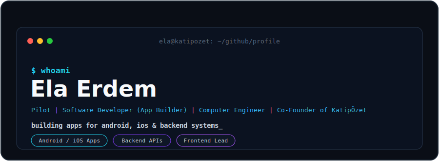

<div align="center">

  

  <br/><br/>

  

  <br/>

  

  <br/><br/>

  <p align="center">
    
    &nbsp;&nbsp;&nbsp;&nbsp;
    
    
    &nbsp;&nbsp;&nbsp;&nbsp;
    
  </p>

  <p align="center">
    
    
  </p>

  <p align="center">
    <sub><b>🛠️ builder mode</b></sub>
    &nbsp;&nbsp;&nbsp;&nbsp;&nbsp;&nbsp;&nbsp;&nbsp;
    <sub><b>🚀 ship mode</b></sub>
  </p>

  <br/>

  
  
  
  

  <br/><br/>

  

  <br/>

  <sub>
    <b>while(coffee) &#123; build(); create(); debug(); ship(); &#125;</b>
  </sub>

</div>

---

# ✦ Brand Identity

<table>
<tr>
<td width="55%">

```yaml
name: Ela Erdem
role: Software Developer (App Builder) · Backend Developer
location: İstanbul, Türkiye
positioning: Building Apps & Scalable Backends
focus:
  - Android & iOS App Development
  - Backend Systems & APIs
  - Frontend Project Lead
  - Full-Stack Product Development
  - Co-Founder @ KatipÖzet
  - Aviation · Pilot
```

</td>
<td width="45%">

### What I Build

▸ Android & iOS applications
▸ Scalable backend systems & APIs
▸ Full-stack web products
▸ Frontend leadership as project lead
▸ KatipÖzet — a live product with real users
▸ Products shipped end-to-end

</td>
</tr>
</table>

I build mobile and web apps end-to-end — from **backend systems and APIs** to polished **frontends**.
As a **co-founder** and **frontend project lead**, I turn ideas into real, shipped products.

> Solving problems with software.

---

# ✦ Professional Dashboard

<div align="center">

<table>
<tr>
<td align="center" width="25%">

<br/><br/>
Android<br/>iOS
</td>
<td align="center" width="25%">

<br/><br/>
REST APIs<br/>Systems
</td>
<td align="center" width="25%">

<br/><br/>
React<br/>Next.js
</td>
<td align="center" width="25%">

<br/><br/>
Co-Founder<br/>Live Product
</td>
</tr>
</table>

</div>

---

# ✦ Certifications

<div align="center">

| Certification | Provider |
| --- | --- |
| 🤖 Yapay Zeka Eklentili Uygulama Geliştirme | Oyun ve Uygulama Akademisi |
| ☁️ Google Cloud Data Analyst Bootcamp | Google Cloud |
| 🎮 Game & App Jam | Oyun ve Uygulama Akademisi |
| 🎓 Mezuniyet Bootcamp | Oyun ve Uygulama Akademisi |
| 🛩 İHA0123 | SHGM / Sivil Havacılık Genel Müdürlüğü |
| ✈ IR(A) Aletli Uçuş Yetkisi | SHGM / Sivil Havacılık Genel Müdürlüğü |
| 🛫 CPL(A) Ticari Pilot Lisansı | SHGM / Sivil Havacılık Genel Müdürlüğü |
| 🧭 PPL (Hususi Pilot Lisansı) | SHGM / Sivil Havacılık Genel Müdürlüğü |
| 💻 Frontend-Backend Web Development | BTK Akademi |

</div>

---

# ✦ Technology Stack

<div align="center">

## Mobile


## Languages & Core


## Frameworks & Backend


## Data & Delivery


</div>

---

# ✦ GitHub Analytics Center

<div align="center">


<br/>


<br/>


</div>

---

# ✦ Contribution Snake

<div align="center">

<picture>
  <source media="(prefers-color-scheme: dark)" srcset="https://raw.githubusercontent.com/elaerdem563-coder/elaerdem563-coder/output/github-contribution-grid-snake-dark.svg" />
  <source media="(prefers-color-scheme: light)" srcset="https://raw.githubusercontent.com/elaerdem563-coder/elaerdem563-coder/output/github-contribution-grid-snake.svg" />
  
</picture>

</div>

> Snake grafiği için repoya bir GitHub Action eklenmesi gerekir. Action eklenmezse bu bölüm görünmeyebilir.

---

# ✦ Current Mission

```text
01. Build and scale apps for Android & iOS
02. Design reliable backend systems & APIs
03. Lead frontend development across products
04. Grow KatipÖzet with real users
05. Aviation — pilot training & discipline
06. Computer Engineering foundations
```

---

# ✦ Connect

<div align="center">

<a href="https://github.com/elaerdem563-coder">

</a>

<a href="https://www.linkedin.com/in/ela-erdem/">

</a>

<a href="https://katipozet.com">

</a>

<a href="mailto:elaerdem563@gmail.com">

</a>

</div>

---

<div align="center">


### “Solving problems with software — one app at a time.”

</div>
